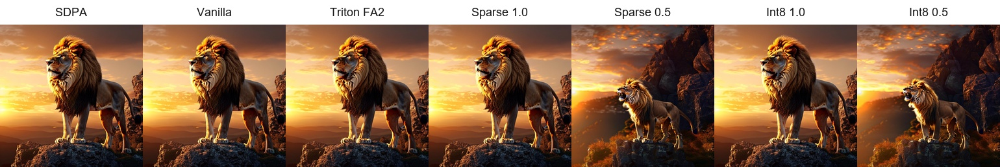
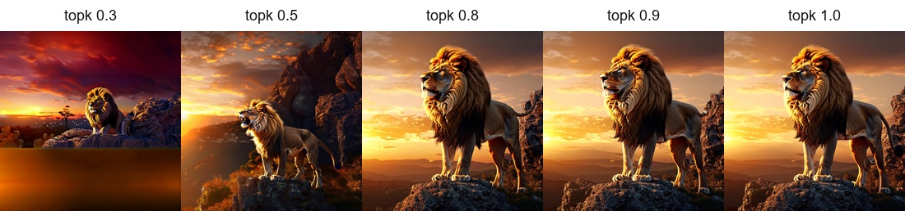
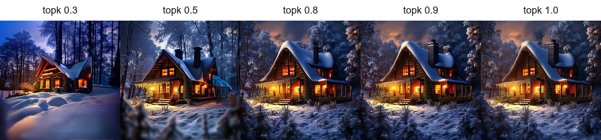
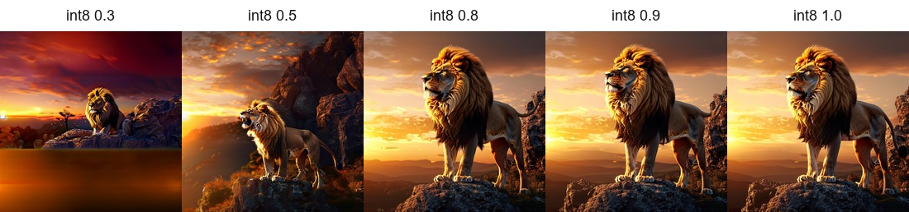
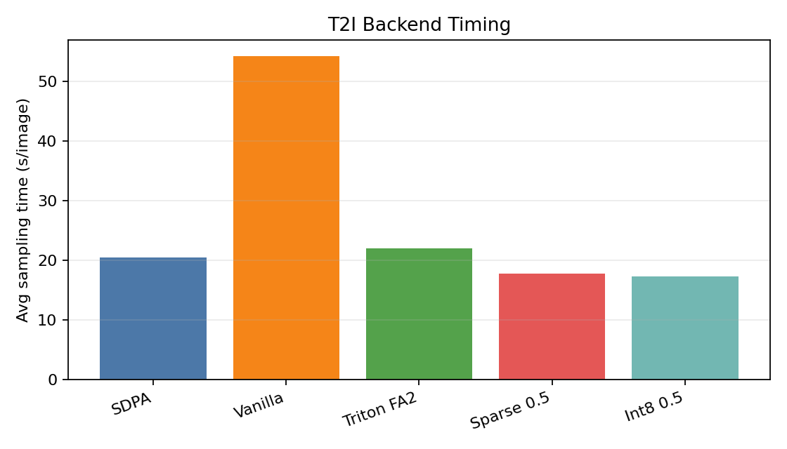
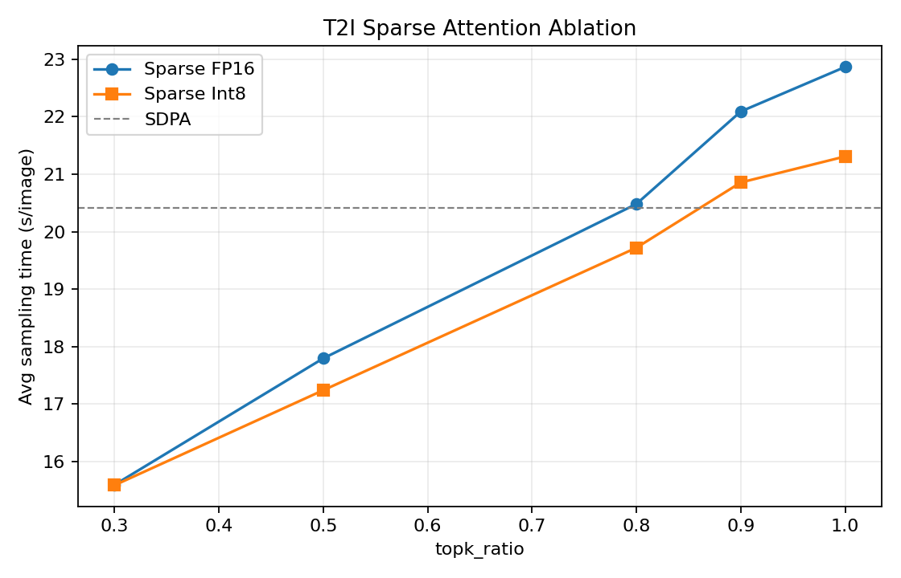
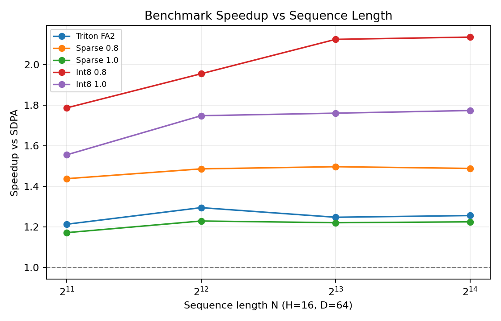
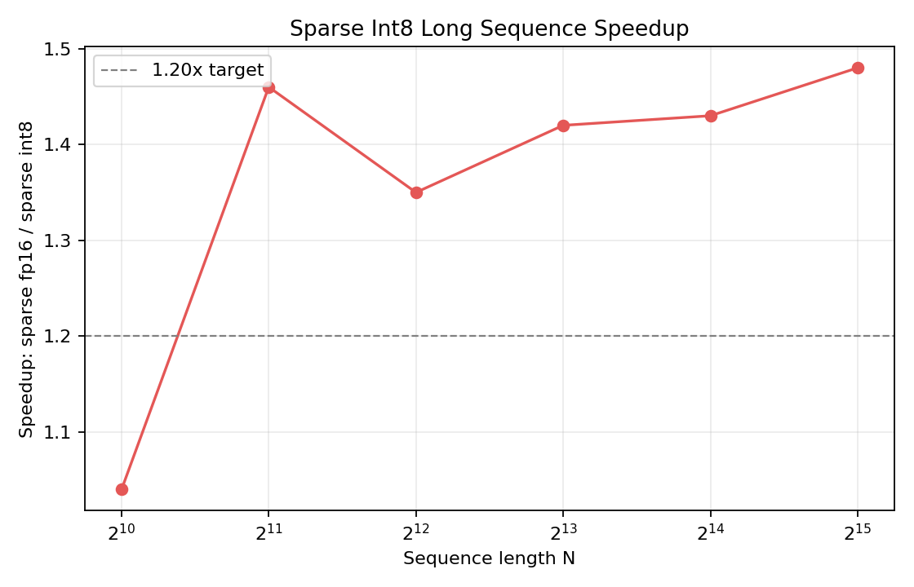

# CM2026 Project 2 实验报告

## 1. 实验设置

本实验实现并评估了以下 Attention 后端：

- Vanilla Attention：使用 PyTorch 张量运算实现标准 scaled dot-product attention。
- Triton Flash Attention 2：使用 Triton 实现 forward-only 的分块 dense attention。
- Block-Sparse Attention：使用 block selection 选择 K/V blocks，并使用 Triton kernel 计算稀疏 attention。
- Sparse Int8 Attention：在 block-sparse attention 基础上，对 Q/K 做 per-block int8 量化，V 保持 fp16。

| 项目 | 配置 |
|---|---|
| Triton | 3.4.0 |
| CUDA | 13.0 |
| GPU | CUDA-capable GPU |

## 2. 任务 1：T2I 生成结果

### 2.1 生成质量对比

图 2-1 展示同一 prompt 在主要 attention 后端下的生成结果。SDPA、Vanilla、Triton FA2、Sparse topk=1.0 和 Sparse Int8 topk=1.0 的主体结构和语义基本一致；当 topk 降到 0.5 时，图像仍能保持 prompt 语义，但构图和局部细节会出现更明显变化。

**图 2-1 T2I attention comparison**：同一 prompt 在 SDPA、Vanilla、Triton FA2、Sparse 和 Sparse Int8 后端下的生成质量对比。

Sparse attention 的 topk 消融结果见图 2-2 和图 2-3。topk 越低，参与 attention 的 K/V blocks 越少，速度越快，但图像细节和构图变化越明显。topk=0.8/0.9 与 topk=1.0 更接近，但速度收益较小。

**图 2-2 Sparse topk prompt 000**：`A majestic lion standing on a rocky cliff at sunset...` 在不同 `topk_ratio` 下的生成结果。

**图 2-3 Sparse topk prompt 001**：`A cozy cottage in a snowy forest...` 在不同 `topk_ratio` 下的生成结果。

Sparse Int8 的 topk 对比结果见图 2-4。在 `topk_ratio ∈ {0.3, 0.5, 0.8, 0.9, 1.0}` 五组设置下均能正常生成图像，没有出现 crash、NaN、全黑或全白结果。

**图 2-4 Sparse Int8 topk prompt 000**：Sparse Int8 在 `prompt 000` 上不同 `topk_ratio` 的生成结果。

### 2.2 平均采样时间

| Attention | topk | 图片数 | 平均采样时间 s/image | 总采样时间 s |
|---|---:|---:|---:|---:|
| SDPA | - | 20 | 20.419 | 408.387 |
| Vanilla | - | 20 | 54.203 | 1084.065 |
| Triton FA2 | - | 20 | 22.001 | 440.023 |
| Sparse | 0.3 | 20 | 15.589 | 311.784 |
| Sparse | 0.5 | 20 | 17.792 | 355.836 |
| Sparse | 0.8 | 20 | 20.481 | 409.626 |
| Sparse | 0.9 | 20 | 22.092 | 441.839 |
| Sparse | 1.0 | 20 | 22.868 | 457.358 |
| Sparse Int8 | 0.3 | 20 | 15.582 | 311.632 |
| Sparse Int8 | 0.5 | 20 | 17.237 | 344.741 |
| Sparse Int8 | 0.8 | 20 | 19.719 | 394.376 |
| Sparse Int8 | 0.9 | 20 | 20.856 | 417.119 |
| Sparse Int8 | 1.0 | 20 | 21.309 | 426.179 |

**图 2-5 T2I backend timing**：不同 attention 后端在 T2I 推理中的平均采样时间对比。

主要结果如下：

- Vanilla 平均 `54.203s/image`，约为 SDPA 耗时的 `2.65x`，速度最慢。
- Triton FA2 平均 `22.001s/image`，约为 SDPA 耗时的 `1.08x`，满足“不超过 SDPA 2.5 倍”的要求。
- Sparse topk=1.0 平均 `22.868s/image`，数值和生成效果接近 dense attention。
- Sparse topk=0.5 平均 `17.792s/image`，相比 topk=1.0 快约 `22.2%`，满足 topk=0.5 至少加速 10% 的要求。
- Sparse Int8 topk=0.5 平均 `17.237s/image`，略快于 fp16 sparse topk=0.5。

### 2.3 topk 消融实验

**图 2-6 T2I topk timing curve**：Sparse 与 Sparse Int8 在不同 `topk_ratio` 下的平均采样时间曲线。

从速度曲线可以看出，topk 越大，平均采样时间越长。对于本次 T2I 推理，Sparse topk=0.5 在质量和速度之间取得了较好的折中：相比 topk=0.3，图像语义和构图更稳定；相比 topk=1.0，采样时间明显下降。Sparse Int8 的曲线整体略低于 fp16 sparse，但由于 PixArt 当前序列长度不算特别长，int8 的优势并没有像长序列 benchmark 中那样明显。

**效果对比**：上文 **图 2-2 Sparse topk prompt 000** 和 **图 2-3 Sparse topk prompt 001** 分别展示了两个 prompt 在 `topk_ratio ∈ {0.3, 0.5, 0.8, 0.9, 1.0}` 下的生成图像。可以看到，降低 topk 并不会立刻破坏 prompt 的主体语义，但会优先影响全局构图稳定性、背景连贯性以及局部纹理细节。

| Prompt | topk=0.3 | topk=0.5 | topk=0.8 | topk=0.9 vs 1.0 |
|---|---|---|---|---|
| prompt 000：`A majestic lion standing on a rocky cliff at sunset...` | 仍能看出狮子和落日语义，但主体比例和站姿不稳定；下半部分出现大面积模糊色块，岩石边缘、爪子、鬃毛纹理和悬崖细节明显丢失。 | 狮子主体、悬崖和夕阳背景基本恢复，语义正确；但构图与 dense 结果仍有差异，岩壁形状、背景山体和鬃毛层次不如高 topk 稳定。 | 主体结构、鬃毛、岩石纹理和夕阳光照已经接近 topk=1.0，仅有轻微构图和局部纹理差异。 | `topk=0.9` 与 `topk=1.0` 在视觉上基本无明显差异，狮子姿态、岩石边缘和背景光照都保持一致，差异主要是很小的亮度和纹理波动。 |
| prompt 001：`A cozy cottage in a snowy forest...` | 小屋、雪地和暖色窗光仍然存在，但小屋比例偏小，森林层次、屋顶积雪、窗框细节、烟囱烟雾和前景雪地纹理明显简化。 | 小屋主体和暖光窗口更稳定，雪地与树木细节比 0.3 更完整；但前景雪纹、树枝轮廓和烟雾仍有模糊，整体空间层次弱于高 topk。 | 屋顶积雪、窗户暖光、烟囱、周围树木和雪地纹理都较清晰，整体观感接近 dense attention。 | `topk=0.9` 与 `topk=1.0` 几乎不可区分，小屋位置、屋顶积雪、窗光、森林背景和前景雪地都保持一致，没有可见的语义或质量退化。 |

因此，从图像质量角度看，`topk=0.3` 的稀疏度过高，最容易丢失小尺度纹理和背景连续性，并可能产生局部伪影；`topk=0.5` 可以保留主体语义但仍会改变部分构图和细节；`topk=0.8` 已经接近 dense 结果；`topk=0.9` 与 `topk=1.0` 在这两个 prompt 上视觉差异很小，主要收益不再是质量提升，而是更接近 dense attention 的稳定性。

### 2.4 逐图采样时间

下表汇总 20 张图在各 attention 后端下的采样时间，单位为秒。

| Image | SDPA | Vanilla | FA2 | Sparse0.3 | Sparse0.5 | Sparse0.8 | Sparse0.9 | Sparse1.0 | Int8-0.3 | Int8-0.5 | Int8-0.8 | Int8-0.9 | Int8-1.0 |
|---:|---:|---:|---:|---:|---:|---:|---:|---:|---:|---:|---:|---:|---:|
| 000 | 18.835 | 52.838 | 21.809 | 15.581 | 18.012 | 20.580 | 21.716 | 22.773 | 16.310 | 17.182 | 19.627 | 21.414 | 21.147 |
| 001 | 18.457 | 53.729 | 21.689 | 14.817 | 17.150 | 19.402 | 21.261 | 22.644 | 14.722 | 16.989 | 18.907 | 20.476 | 20.697 |
| 002 | 19.089 | 54.031 | 22.105 | 15.430 | 18.381 | 19.902 | 21.716 | 22.698 | 14.914 | 17.068 | 19.144 | 20.629 | 21.220 |
| 003 | 19.874 | 53.859 | 22.266 | 15.519 | 17.936 | 19.959 | 21.935 | 22.506 | 15.053 | 17.675 | 19.716 | 21.058 | 21.401 |
| 004 | 20.018 | 54.501 | 22.339 | 15.365 | 17.781 | 20.001 | 21.926 | 22.837 | 15.137 | 17.335 | 19.486 | 21.001 | 21.281 |
| 005 | 20.273 | 54.315 | 22.328 | 15.583 | 17.886 | 20.320 | 22.148 | 23.202 | 15.274 | 17.313 | 19.702 | 20.981 | 21.313 |
| 006 | 21.338 | 54.449 | 22.226 | 15.425 | 17.817 | 20.400 | 21.992 | 22.832 | 15.276 | 17.433 | 19.819 | 20.805 | 21.268 |
| 007 | 21.553 | 53.826 | 22.215 | 15.535 | 18.019 | 20.376 | 22.119 | 22.666 | 15.399 | 17.207 | 19.672 | 20.630 | 21.515 |
| 008 | 20.944 | 54.066 | 22.203 | 15.585 | 17.858 | 20.487 | 22.598 | 22.986 | 15.745 | 17.492 | 19.673 | 20.864 | 21.372 |
| 009 | 20.599 | 54.394 | 22.153 | 15.332 | 17.843 | 20.763 | 22.277 | 22.529 | 15.851 | 17.662 | 19.805 | 20.943 | 21.618 |
| 010 | 20.700 | 54.576 | 22.287 | 15.383 | 17.852 | 20.726 | 22.185 | 22.481 | 15.905 | 17.415 | 19.644 | 20.588 | 21.388 |
| 011 | 20.618 | 55.027 | 22.200 | 15.216 | 17.761 | 20.764 | 22.347 | 22.700 | 15.811 | 17.403 | 19.687 | 20.881 | 21.256 |
| 012 | 20.547 | 54.227 | 22.044 | 15.436 | 17.731 | 20.839 | 22.259 | 22.785 | 16.037 | 17.597 | 19.735 | 20.882 | 21.361 |
| 013 | 20.625 | 53.721 | 21.907 | 15.668 | 17.666 | 20.722 | 22.393 | 23.357 | 15.826 | 17.231 | 19.850 | 20.913 | 21.478 |
| 014 | 20.673 | 54.067 | 21.959 | 16.198 | 17.707 | 20.797 | 22.409 | 22.950 | 15.743 | 17.278 | 19.849 | 21.105 | 21.388 |
| 015 | 20.650 | 54.442 | 21.681 | 16.096 | 18.114 | 20.817 | 22.237 | 23.236 | 15.692 | 16.944 | 19.712 | 20.877 | 21.331 |
| 016 | 20.841 | 54.481 | 21.803 | 15.972 | 17.527 | 20.672 | 22.044 | 23.186 | 15.763 | 16.912 | 19.927 | 20.752 | 21.360 |
| 017 | 20.927 | 54.691 | 21.575 | 15.897 | 17.494 | 20.694 | 22.089 | 23.075 | 15.663 | 16.957 | 20.172 | 20.854 | 21.208 |
| 018 | 21.105 | 54.836 | 21.478 | 15.916 | 17.931 | 20.602 | 22.065 | 22.885 | 15.568 | 16.838 | 20.137 | 20.704 | 21.247 |
| 019 | 20.721 | 53.988 | 21.756 | 15.831 | 17.370 | 20.801 | 22.125 | 23.031 | 15.943 | 16.811 | 20.113 | 20.759 | 21.330 |

## 3. 任务 2：Attention Benchmark 结果

### 3.1 benchmark_attention.py 结果

Benchmark 设置为 `B=2`、fp16、warmup 10、iterations 50，测试 `N ∈ {2048,4096,8192,16384}`、`H ∈ {8,16}`、`D ∈ {64,128}`。下表列出脚本中所有后端在不同 `(H,N,D)` 下的速度和精度结果。Speedup 定义为 `time_SDPA / time_backend`。

| H | N | D | Backend | Time ms | Speedup | CosSim | RelL1 | RMSE |
|---:|---:|---:|---|---:|---:|---:|---:|---:|
| 8 | 2048 | 64 | sdpa | 1.019 | 1.00x | ref | ref | ref |
| 8 | 2048 | 64 | triton_fa2 | 0.878 | 1.16x | 1.000000 | 1.22e-07 | 3.40e-07 |
| 8 | 2048 | 64 | sparse(topk=0.3) | 0.346 | 2.95x | 0.568328 | 1.46e+00 | 5.37e-02 |
| 8 | 2048 | 64 | sparse(topk=0.5) | 0.512 | 1.99x | 0.716150 | 9.82e-01 | 3.61e-02 |
| 8 | 2048 | 64 | sparse(topk=0.8) | 0.790 | 1.29x | 0.906143 | 4.66e-01 | 1.72e-02 |
| 8 | 2048 | 64 | sparse(topk=0.9) | 0.876 | 1.16x | 0.954667 | 3.08e-01 | 1.15e-02 |
| 8 | 2048 | 64 | sparse(topk=1.0) | 0.908 | 1.12x | 1.000000 | 1.22e-07 | 3.40e-07 |
| 8 | 2048 | 64 | sparse_int8(topk=0.3) | 0.459 | 2.22x | 0.568283 | 1.46e+00 | 5.37e-02 |
| 8 | 2048 | 64 | sparse_int8(topk=0.5) | 0.454 | 2.24x | 0.716097 | 9.82e-01 | 3.61e-02 |
| 8 | 2048 | 64 | sparse_int8(topk=0.8) | 0.629 | 1.62x | 0.906069 | 4.66e-01 | 1.72e-02 |
| 8 | 2048 | 64 | sparse_int8(topk=0.9) | 0.652 | 1.56x | 0.954590 | 3.08e-01 | 1.15e-02 |
| 8 | 2048 | 64 | sparse_int8(topk=1.0) | 0.643 | 1.59x | 0.999924 | 1.22e-02 | 4.53e-04 |
| 8 | 4096 | 64 | sdpa | 3.672 | 1.00x | ref | ref | ref |
| 8 | 4096 | 64 | triton_fa2 | 3.090 | 1.19x | 1.000000 | 1.73e-07 | 2.88e-07 |
| 8 | 4096 | 64 | sparse(topk=0.3) | 0.885 | 4.15x | 0.563492 | 1.49e+00 | 3.81e-02 |
| 8 | 4096 | 64 | sparse(topk=0.5) | 1.830 | 2.01x | 0.711020 | 9.99e-01 | 2.56e-02 |
| 8 | 4096 | 64 | sparse(topk=0.8) | 2.608 | 1.41x | 0.903882 | 4.74e-01 | 1.22e-02 |
| 8 | 4096 | 64 | sparse(topk=0.9) | 2.827 | 1.30x | 0.953636 | 3.14e-01 | 8.11e-03 |
| 8 | 4096 | 64 | sparse(topk=1.0) | 3.269 | 1.12x | 1.000000 | 1.73e-07 | 2.88e-07 |
| 8 | 4096 | 64 | sparse_int8(topk=0.3) | 0.799 | 4.60x | 0.563436 | 1.49e+00 | 3.81e-02 |
| 8 | 4096 | 64 | sparse_int8(topk=0.5) | 1.104 | 3.33x | 0.710958 | 1.00e+00 | 2.56e-02 |
| 8 | 4096 | 64 | sparse_int8(topk=0.8) | 2.049 | 1.79x | 0.903810 | 4.74e-01 | 1.22e-02 |
| 8 | 4096 | 64 | sparse_int8(topk=0.9) | 2.073 | 1.77x | 0.953557 | 3.14e-01 | 8.12e-03 |
| 8 | 4096 | 64 | sparse_int8(topk=1.0) | 2.468 | 1.49x | 0.999921 | 1.25e-02 | 3.22e-04 |
| 8 | 8192 | 64 | sdpa | 16.430 | 1.00x | ref | ref | ref |
| 8 | 8192 | 64 | triton_fa2 | 12.612 | 1.30x | 1.000000 | 2.35e-07 | 2.37e-07 |
| 8 | 8192 | 64 | sparse(topk=0.3) | 4.809 | 3.42x | 0.561869 | 1.50e+00 | 2.75e-02 |
| 8 | 8192 | 64 | sparse(topk=0.5) | 6.642 | 2.47x | 0.715210 | 9.89e-01 | 1.81e-02 |
| 8 | 8192 | 64 | sparse(topk=0.8) | 11.006 | 1.49x | 0.901425 | 4.82e-01 | 8.84e-03 |
| 8 | 8192 | 64 | sparse(topk=0.9) | 12.556 | 1.31x | 0.954497 | 3.12e-01 | 5.74e-03 |
| 8 | 8192 | 64 | sparse(topk=1.0) | 13.813 | 1.19x | 1.000000 | 2.35e-07 | 2.37e-07 |
| 8 | 8192 | 64 | sparse_int8(topk=0.3) | 3.104 | 5.29x | 0.561830 | 1.50e+00 | 2.75e-02 |
| 8 | 8192 | 64 | sparse_int8(topk=0.5) | 4.759 | 3.45x | 0.715155 | 9.89e-01 | 1.81e-02 |
| 8 | 8192 | 64 | sparse_int8(topk=0.8) | 7.575 | 2.17x | 0.901359 | 4.82e-01 | 8.84e-03 |
| 8 | 8192 | 64 | sparse_int8(topk=0.9) | 8.687 | 1.89x | 0.954424 | 3.12e-01 | 5.74e-03 |
| 8 | 8192 | 64 | sparse_int8(topk=1.0) | 8.714 | 1.89x | 0.999923 | 1.23e-02 | 2.28e-04 |
| 8 | 16384 | 64 | sdpa | 65.579 | 1.00x | ref | ref | ref |
| 8 | 16384 | 64 | triton_fa2 | 52.798 | 1.24x | 1.000000 | 3.24e-07 | 1.96e-07 |
| 8 | 16384 | 64 | sparse(topk=0.3) | 16.843 | 3.89x | 0.557912 | 1.52e+00 | 1.96e-02 |
| 8 | 16384 | 64 | sparse(topk=0.5) | 27.587 | 2.38x | 0.715232 | 9.90e-01 | 1.28e-02 |
| 8 | 16384 | 64 | sparse(topk=0.8) | 44.831 | 1.46x | 0.899504 | 4.88e-01 | 6.33e-03 |
| 8 | 16384 | 64 | sparse(topk=0.9) | 50.187 | 1.31x | 0.952467 | 3.20e-01 | 4.16e-03 |
| 8 | 16384 | 64 | sparse(topk=1.0) | 54.093 | 1.21x | 1.000000 | 3.24e-07 | 1.96e-07 |
| 8 | 16384 | 64 | sparse_int8(topk=0.3) | 12.508 | 5.24x | 0.557873 | 1.52e+00 | 1.96e-02 |
| 8 | 16384 | 64 | sparse_int8(topk=0.5) | 19.524 | 3.36x | 0.715182 | 9.90e-01 | 1.28e-02 |
| 8 | 16384 | 64 | sparse_int8(topk=0.8) | 30.968 | 2.12x | 0.899439 | 4.88e-01 | 6.33e-03 |
| 8 | 16384 | 64 | sparse_int8(topk=0.9) | 33.838 | 1.94x | 0.952394 | 3.20e-01 | 4.16e-03 |
| 8 | 16384 | 64 | sparse_int8(topk=1.0) | 36.930 | 1.78x | 0.999923 | 1.23e-02 | 1.61e-04 |
| 16 | 2048 | 64 | sdpa | 2.103 | 1.00x | ref | ref | ref |
| 16 | 2048 | 64 | triton_fa2 | 1.732 | 1.21x | 1.000000 | 1.16e-07 | 3.36e-07 |
| 16 | 2048 | 64 | sparse(topk=0.3) | 0.601 | 3.50x | 0.567955 | 1.47e+00 | 5.37e-02 |
| 16 | 2048 | 64 | sparse(topk=0.5) | 0.895 | 2.35x | 0.714983 | 9.90e-01 | 3.62e-02 |
| 16 | 2048 | 64 | sparse(topk=0.8) | 1.462 | 1.44x | 0.905062 | 4.69e-01 | 1.73e-02 |
| 16 | 2048 | 64 | sparse(topk=0.9) | 1.656 | 1.27x | 0.954092 | 3.10e-01 | 1.15e-02 |
| 16 | 2048 | 64 | sparse(topk=1.0) | 1.793 | 1.17x | 1.000000 | 1.16e-07 | 3.36e-07 |
| 16 | 2048 | 64 | sparse_int8(topk=0.3) | 0.654 | 3.22x | 0.567917 | 1.47e+00 | 5.37e-02 |
| 16 | 2048 | 64 | sparse_int8(topk=0.5) | 0.821 | 2.56x | 0.714931 | 9.90e-01 | 3.62e-02 |
| 16 | 2048 | 64 | sparse_int8(topk=0.8) | 1.177 | 1.79x | 0.904990 | 4.69e-01 | 1.73e-02 |
| 16 | 2048 | 64 | sparse_int8(topk=0.9) | 1.279 | 1.64x | 0.954015 | 3.11e-01 | 1.15e-02 |
| 16 | 2048 | 64 | sparse_int8(topk=1.0) | 1.352 | 1.56x | 0.999923 | 1.23e-02 | 4.54e-04 |
| 16 | 4096 | 64 | sdpa | 8.527 | 1.00x | ref | ref | ref |
| 16 | 4096 | 64 | triton_fa2 | 6.582 | 1.30x | 1.000000 | 1.74e-07 | 2.90e-07 |
| 16 | 4096 | 64 | sparse(topk=0.3) | 2.425 | 3.52x | 0.567088 | 1.48e+00 | 3.81e-02 |
| 16 | 4096 | 64 | sparse(topk=0.5) | 3.740 | 2.28x | 0.712959 | 9.93e-01 | 2.56e-02 |
| 16 | 4096 | 64 | sparse(topk=0.8) | 5.737 | 1.49x | 0.904809 | 4.71e-01 | 1.22e-02 |
| 16 | 4096 | 64 | sparse(topk=0.9) | 6.433 | 1.33x | 0.953932 | 3.12e-01 | 8.13e-03 |
| 16 | 4096 | 64 | sparse(topk=1.0) | 6.934 | 1.23x | 1.000000 | 1.74e-07 | 2.90e-07 |
| 16 | 4096 | 64 | sparse_int8(topk=0.3) | 2.073 | 4.11x | 0.567051 | 1.48e+00 | 3.81e-02 |
| 16 | 4096 | 64 | sparse_int8(topk=0.5) | 2.960 | 2.88x | 0.712904 | 9.93e-01 | 2.56e-02 |
| 16 | 4096 | 64 | sparse_int8(topk=0.8) | 4.364 | 1.95x | 0.904740 | 4.71e-01 | 1.22e-02 |
| 16 | 4096 | 64 | sparse_int8(topk=0.9) | 4.789 | 1.78x | 0.953860 | 3.12e-01 | 8.13e-03 |
| 16 | 4096 | 64 | sparse_int8(topk=1.0) | 4.879 | 1.75x | 0.999922 | 1.23e-02 | 3.21e-04 |
| 16 | 8192 | 64 | sdpa | 33.669 | 1.00x | ref | ref | ref |
| 16 | 8192 | 64 | triton_fa2 | 26.974 | 1.25x | 1.000000 | 2.27e-07 | 2.33e-07 |
| 16 | 8192 | 64 | sparse(topk=0.3) | 9.026 | 3.73x | 0.561951 | 1.50e+00 | 2.75e-02 |
| 16 | 8192 | 64 | sparse(topk=0.5) | 14.341 | 2.35x | 0.715758 | 9.87e-01 | 1.81e-02 |
| 16 | 8192 | 64 | sparse(topk=0.8) | 22.492 | 1.50x | 0.901554 | 4.81e-01 | 8.85e-03 |
| 16 | 8192 | 64 | sparse(topk=0.9) | 25.284 | 1.33x | 0.954555 | 3.11e-01 | 5.74e-03 |
| 16 | 8192 | 64 | sparse(topk=1.0) | 27.566 | 1.22x | 1.000000 | 2.27e-07 | 2.33e-07 |
| 16 | 8192 | 64 | sparse_int8(topk=0.3) | 6.946 | 4.85x | 0.561896 | 1.50e+00 | 2.75e-02 |
| 16 | 8192 | 64 | sparse_int8(topk=0.5) | 10.416 | 3.23x | 0.715696 | 9.87e-01 | 1.81e-02 |
| 16 | 8192 | 64 | sparse_int8(topk=0.8) | 15.857 | 2.12x | 0.901482 | 4.82e-01 | 8.85e-03 |
| 16 | 8192 | 64 | sparse_int8(topk=0.9) | 18.547 | 1.82x | 0.954480 | 3.12e-01 | 5.75e-03 |
| 16 | 8192 | 64 | sparse_int8(topk=1.0) | 19.128 | 1.76x | 0.999923 | 1.23e-02 | 2.27e-04 |
| 16 | 16384 | 64 | sdpa | 131.887 | 1.00x | ref | ref | ref |
| 16 | 16384 | 64 | triton_fa2 | 104.949 | 1.26x | 1.000000 | 3.20e-07 | 1.96e-07 |
| 16 | 16384 | 64 | sparse(topk=0.3) | 34.362 | 3.84x | 0.562662 | 1.50e+00 | 1.96e-02 |
| 16 | 16384 | 64 | sparse(topk=0.5) | 55.776 | 2.36x | 0.719413 | 9.78e-01 | 1.28e-02 |
| 16 | 16384 | 64 | sparse(topk=0.8) | 88.602 | 1.49x | 0.901075 | 4.83e-01 | 6.33e-03 |
| 16 | 16384 | 64 | sparse(topk=0.9) | 100.696 | 1.31x | 0.953380 | 3.16e-01 | 4.15e-03 |
| 16 | 16384 | 64 | sparse(topk=1.0) | 107.601 | 1.23x | 1.000000 | 3.20e-07 | 1.96e-07 |
| 16 | 16384 | 64 | sparse_int8(topk=0.3) | 25.604 | 5.15x | 0.562620 | 1.50e+00 | 1.96e-02 |
| 16 | 16384 | 64 | sparse_int8(topk=0.5) | 40.089 | 3.29x | 0.719355 | 9.78e-01 | 1.28e-02 |
| 16 | 16384 | 64 | sparse_int8(topk=0.8) | 61.788 | 2.13x | 0.901004 | 4.83e-01 | 6.33e-03 |
| 16 | 16384 | 64 | sparse_int8(topk=0.9) | 68.315 | 1.93x | 0.953306 | 3.17e-01 | 4.15e-03 |
| 16 | 16384 | 64 | sparse_int8(topk=1.0) | 74.374 | 1.77x | 0.999924 | 1.22e-02 | 1.61e-04 |
| 8 | 2048 | 128 | sdpa | 2.401 | 1.00x | ref | ref | ref |
| 8 | 2048 | 128 | triton_fa2 | 1.908 | 1.26x | 1.000000 | 5.22e-05 | 5.60e-06 |
| 8 | 2048 | 128 | sparse(topk=0.3) | 0.689 | 3.49x | 0.569083 | 1.46e+00 | 5.34e-02 |
| 8 | 2048 | 128 | sparse(topk=0.5) | 1.127 | 2.13x | 0.715998 | 9.86e-01 | 3.60e-02 |
| 8 | 2048 | 128 | sparse(topk=0.8) | 2.001 | 1.20x | 0.905522 | 4.69e-01 | 1.72e-02 |
| 8 | 2048 | 128 | sparse(topk=0.9) | 1.904 | 1.26x | 0.954556 | 3.09e-01 | 1.14e-02 |
| 8 | 2048 | 128 | sparse(topk=1.0) | 1.943 | 1.24x | 1.000000 | 5.22e-05 | 5.60e-06 |
| 8 | 2048 | 128 | sparse_int8(topk=0.3) | 4.021 | 0.60x | 0.569049 | 1.46e+00 | 5.34e-02 |
| 8 | 2048 | 128 | sparse_int8(topk=0.5) | 1.183 | 2.03x | 0.715945 | 9.86e-01 | 3.60e-02 |
| 8 | 2048 | 128 | sparse_int8(topk=0.8) | 2.624 | 0.91x | 0.905450 | 4.69e-01 | 1.72e-02 |
| 8 | 2048 | 128 | sparse_int8(topk=0.9) | 1.753 | 1.37x | 0.954480 | 3.09e-01 | 1.15e-02 |
| 8 | 2048 | 128 | sparse_int8(topk=1.0) | 1.849 | 1.30x | 0.999917 | 1.28e-02 | 4.69e-04 |
| 8 | 4096 | 128 | sdpa | 8.756 | 1.00x | ref | ref | ref |
| 8 | 4096 | 128 | triton_fa2 | 8.307 | 1.05x | 1.000000 | 4.25e-05 | 3.56e-06 |
| 8 | 4096 | 128 | sparse(topk=0.3) | 2.620 | 3.34x | 0.566007 | 1.48e+00 | 3.80e-02 |
| 8 | 4096 | 128 | sparse(topk=0.5) | 4.176 | 2.10x | 0.713715 | 9.92e-01 | 2.55e-02 |
| 8 | 4096 | 128 | sparse(topk=0.8) | 7.051 | 1.24x | 0.904990 | 4.70e-01 | 1.21e-02 |
| 8 | 4096 | 128 | sparse(topk=0.9) | 7.894 | 1.11x | 0.954238 | 3.11e-01 | 8.08e-03 |
| 8 | 4096 | 128 | sparse(topk=1.0) | 8.622 | 1.02x | 1.000000 | 4.25e-05 | 3.56e-06 |
| 8 | 4096 | 128 | sparse_int8(topk=0.3) | 2.672 | 3.28x | 0.565959 | 1.48e+00 | 3.80e-02 |
| 8 | 4096 | 128 | sparse_int8(topk=0.5) | 3.955 | 2.21x | 0.713656 | 9.93e-01 | 2.55e-02 |
| 8 | 4096 | 128 | sparse_int8(topk=0.8) | 6.022 | 1.45x | 0.904914 | 4.71e-01 | 1.22e-02 |
| 8 | 4096 | 128 | sparse_int8(topk=0.9) | 6.658 | 1.32x | 0.954157 | 3.12e-01 | 8.09e-03 |
| 8 | 4096 | 128 | sparse_int8(topk=1.0) | 7.335 | 1.19x | 0.999916 | 1.29e-02 | 3.33e-04 |
| 8 | 8192 | 128 | sdpa | 34.516 | 1.00x | ref | ref | ref |
| 8 | 8192 | 128 | triton_fa2 | 35.417 | 0.97x | 1.000000 | 3.37e-05 | 2.26e-06 |
| 8 | 8192 | 128 | sparse(topk=0.3) | 11.155 | 3.09x | 0.562803 | 1.49e+00 | 2.74e-02 |
| 8 | 8192 | 128 | sparse(topk=0.5) | 18.290 | 1.89x | 0.716521 | 9.83e-01 | 1.81e-02 |
| 8 | 8192 | 128 | sparse(topk=0.8) | 29.142 | 1.18x | 0.902139 | 4.79e-01 | 8.82e-03 |
| 8 | 8192 | 128 | sparse(topk=0.9) | 32.937 | 1.05x | 0.954849 | 3.10e-01 | 5.73e-03 |
| 8 | 8192 | 128 | sparse(topk=1.0) | 36.192 | 0.95x | 1.000000 | 3.37e-05 | 2.26e-06 |
| 8 | 8192 | 128 | sparse_int8(topk=0.3) | 9.752 | 3.54x | 0.562753 | 1.49e+00 | 2.74e-02 |
| 8 | 8192 | 128 | sparse_int8(topk=0.5) | 15.809 | 2.18x | 0.716460 | 9.83e-01 | 1.81e-02 |
| 8 | 8192 | 128 | sparse_int8(topk=0.8) | 25.194 | 1.37x | 0.902064 | 4.79e-01 | 8.83e-03 |
| 8 | 8192 | 128 | sparse_int8(topk=0.9) | 28.046 | 1.23x | 0.954770 | 3.10e-01 | 5.73e-03 |
| 8 | 8192 | 128 | sparse_int8(topk=1.0) | 30.620 | 1.13x | 0.999918 | 1.27e-02 | 2.35e-04 |
| 8 | 16384 | 128 | sdpa | 138.473 | 1.00x | ref | ref | ref |
| 8 | 16384 | 128 | triton_fa2 | 143.640 | 0.96x | 1.000000 | 2.70e-05 | 1.43e-06 |
| 8 | 16384 | 128 | sparse(topk=0.3) | 44.650 | 3.10x | 0.559391 | 1.51e+00 | 1.95e-02 |
| 8 | 16384 | 128 | sparse(topk=0.5) | 72.569 | 1.91x | 0.716381 | 9.84e-01 | 1.27e-02 |
| 8 | 16384 | 128 | sparse(topk=0.8) | 117.034 | 1.18x | 0.899964 | 4.86e-01 | 6.30e-03 |
| 8 | 16384 | 128 | sparse(topk=0.9) | 130.577 | 1.06x | 0.952819 | 3.18e-01 | 4.13e-03 |
| 8 | 16384 | 128 | sparse(topk=1.0) | 145.003 | 0.95x | 1.000000 | 2.70e-05 | 1.43e-06 |
| 8 | 16384 | 128 | sparse_int8(topk=0.3) | 38.777 | 3.57x | 0.559348 | 1.51e+00 | 1.95e-02 |
| 8 | 16384 | 128 | sparse_int8(topk=0.5) | 61.653 | 2.25x | 0.716325 | 9.84e-01 | 1.27e-02 |
| 8 | 16384 | 128 | sparse_int8(topk=0.8) | 96.886 | 1.43x | 0.899891 | 4.86e-01 | 6.30e-03 |
| 8 | 16384 | 128 | sparse_int8(topk=0.9) | 109.293 | 1.27x | 0.952740 | 3.18e-01 | 4.14e-03 |
| 8 | 16384 | 128 | sparse_int8(topk=1.0) | 120.660 | 1.15x | 0.999917 | 1.28e-02 | 1.66e-04 |
| 16 | 2048 | 128 | sdpa | 4.476 | 1.00x | ref | ref | ref |
| 16 | 2048 | 128 | triton_fa2 | 4.563 | 0.98x | 1.000000 | 5.21e-05 | 5.58e-06 |
| 16 | 2048 | 128 | sparse(topk=0.3) | 1.669 | 2.68x | 0.566581 | 1.47e+00 | 5.35e-02 |
| 16 | 2048 | 128 | sparse(topk=0.5) | 2.447 | 1.83x | 0.713754 | 9.90e-01 | 3.60e-02 |
| 16 | 2048 | 128 | sparse(topk=0.8) | 3.913 | 1.14x | 0.904845 | 4.69e-01 | 1.72e-02 |
| 16 | 2048 | 128 | sparse(topk=0.9) | 4.435 | 1.01x | 0.954152 | 3.10e-01 | 1.14e-02 |
| 16 | 2048 | 128 | sparse(topk=1.0) | 4.578 | 0.98x | 1.000000 | 5.21e-05 | 5.58e-06 |
| 16 | 2048 | 128 | sparse_int8(topk=0.3) | 1.848 | 2.42x | 0.566536 | 1.47e+00 | 5.36e-02 |
| 16 | 2048 | 128 | sparse_int8(topk=0.5) | 2.515 | 1.78x | 0.713693 | 9.90e-01 | 3.60e-02 |
| 16 | 2048 | 128 | sparse_int8(topk=0.8) | 3.785 | 1.18x | 0.904769 | 4.70e-01 | 1.72e-02 |
| 16 | 2048 | 128 | sparse_int8(topk=0.9) | 3.963 | 1.13x | 0.954073 | 3.10e-01 | 1.14e-02 |
| 16 | 2048 | 128 | sparse_int8(topk=1.0) | 4.293 | 1.04x | 0.999917 | 1.28e-02 | 4.70e-04 |
| 16 | 4096 | 128 | sdpa | 17.619 | 1.00x | ref | ref | ref |
| 16 | 4096 | 128 | triton_fa2 | 17.885 | 0.99x | 1.000000 | 4.20e-05 | 3.56e-06 |
| 16 | 4096 | 128 | sparse(topk=0.3) | 6.270 | 2.81x | 0.567089 | 1.47e+00 | 3.80e-02 |
| 16 | 4096 | 128 | sparse(topk=0.5) | 9.645 | 1.83x | 0.714590 | 9.87e-01 | 2.55e-02 |
| 16 | 4096 | 128 | sparse(topk=0.8) | 15.364 | 1.15x | 0.905560 | 4.68e-01 | 1.22e-02 |
| 16 | 4096 | 128 | sparse(topk=0.9) | 16.795 | 1.05x | 0.954373 | 3.11e-01 | 8.11e-03 |
| 16 | 4096 | 128 | sparse(topk=1.0) | 18.114 | 0.97x | 1.000000 | 4.20e-05 | 3.56e-06 |
| 16 | 4096 | 128 | sparse_int8(topk=0.3) | 5.992 | 2.94x | 0.567044 | 1.47e+00 | 3.80e-02 |
| 16 | 4096 | 128 | sparse_int8(topk=0.5) | 8.850 | 1.99x | 0.714532 | 9.87e-01 | 2.55e-02 |
| 16 | 4096 | 128 | sparse_int8(topk=0.8) | 13.384 | 1.32x | 0.905486 | 4.69e-01 | 1.22e-02 |
| 16 | 4096 | 128 | sparse_int8(topk=0.9) | 14.794 | 1.19x | 0.954295 | 3.11e-01 | 8.12e-03 |
| 16 | 4096 | 128 | sparse_int8(topk=1.0) | 15.947 | 1.10x | 0.999918 | 1.27e-02 | 3.32e-04 |
| 16 | 8192 | 128 | sdpa | 69.587 | 1.00x | ref | ref | ref |
| 16 | 8192 | 128 | triton_fa2 | 70.526 | 0.99x | 1.000000 | 3.39e-05 | 2.26e-06 |
| 16 | 8192 | 128 | sparse(topk=0.3) | 22.904 | 3.04x | 0.562800 | 1.49e+00 | 2.73e-02 |
| 16 | 8192 | 128 | sparse(topk=0.5) | 36.763 | 1.89x | 0.716355 | 9.85e-01 | 1.80e-02 |
| 16 | 8192 | 128 | sparse(topk=0.8) | 58.524 | 1.19x | 0.901938 | 4.80e-01 | 8.80e-03 |
| 16 | 8192 | 128 | sparse(topk=0.9) | 65.656 | 1.06x | 0.954796 | 3.10e-01 | 5.71e-03 |
| 16 | 8192 | 128 | sparse(topk=1.0) | 71.799 | 0.97x | 1.000000 | 3.39e-05 | 2.26e-06 |
| 16 | 8192 | 128 | sparse_int8(topk=0.3) | 20.611 | 3.38x | 0.562754 | 1.49e+00 | 2.73e-02 |
| 16 | 8192 | 128 | sparse_int8(topk=0.5) | 32.515 | 2.14x | 0.716297 | 9.85e-01 | 1.80e-02 |
| 16 | 8192 | 128 | sparse_int8(topk=0.8) | 50.378 | 1.38x | 0.901864 | 4.80e-01 | 8.81e-03 |
| 16 | 8192 | 128 | sparse_int8(topk=0.9) | 55.929 | 1.24x | 0.954718 | 3.11e-01 | 5.72e-03 |
| 16 | 8192 | 128 | sparse_int8(topk=1.0) | 60.330 | 1.15x | 0.999918 | 1.28e-02 | 2.35e-04 |
| 16 | 16384 | 128 | sdpa | 277.092 | 1.00x | ref | ref | ref |
| 16 | 16384 | 128 | triton_fa2 | 279.068 | 0.99x | 1.000000 | 2.70e-05 | 1.43e-06 |
| 16 | 16384 | 128 | sparse(topk=0.3) | 87.712 | 3.16x | 0.560019 | 1.51e+00 | 1.96e-02 |
| 16 | 16384 | 128 | sparse(topk=0.5) | 144.276 | 1.92x | 0.717207 | 9.84e-01 | 1.28e-02 |
| 16 | 16384 | 128 | sparse(topk=0.8) | 229.690 | 1.21x | 0.900387 | 4.86e-01 | 6.31e-03 |
| 16 | 16384 | 128 | sparse(topk=0.9) | 259.078 | 1.07x | 0.953108 | 3.18e-01 | 4.14e-03 |
| 16 | 16384 | 128 | sparse(topk=1.0) | 291.577 | 0.95x | 1.000000 | 2.70e-05 | 1.43e-06 |
| 16 | 16384 | 128 | sparse_int8(topk=0.3) | 76.740 | 3.61x | 0.559973 | 1.51e+00 | 1.96e-02 |
| 16 | 16384 | 128 | sparse_int8(topk=0.5) | 122.756 | 2.26x | 0.717148 | 9.84e-01 | 1.28e-02 |
| 16 | 16384 | 128 | sparse_int8(topk=0.8) | 191.269 | 1.45x | 0.900314 | 4.86e-01 | 6.31e-03 |
| 16 | 16384 | 128 | sparse_int8(topk=0.9) | 218.541 | 1.27x | 0.953030 | 3.18e-01 | 4.14e-03 |
| 16 | 16384 | 128 | sparse_int8(topk=1.0) | 245.049 | 1.13x | 0.999918 | 1.28e-02 | 1.66e-04 |

**图 3-1 Benchmark speedup**：`H=16,D=64` 配置下各 attention 后端相对 SDPA 的 speedup 对比。

### 3.2 达标情况

速度方面，`benchmark_attention.py` 中所有被测后端在 16 个 `(H,N,D)` 配置下均满足“不低于 SDPA 40%”的要求。全部结果中的最低 speedup 为 `0.597x`，出现在短序列配置 `H=8,N=2048,D=128` 的 `sparse_int8(topk=0.3)`；该值仍高于 `0.4x` 的速度阈值。

| 后端 | 结果 |
|---|---|
| Triton FA2 | 16 个配置全部满足速度与精度要求；最小 speedup 为 `0.964x`，最大 RelL1 为 `5.22e-05`。 |
| Sparse topk=1.0 | 16 个配置全部满足 dense 等价验证；最小 speedup 为 `0.950x`。 |
| Sparse topk=0.8 | 16 个配置全部满足精度要求；最小 CosSim 为 `0.8995`，最大 RelL1 为 `0.488`。 |
| Sparse Int8 topk=1.0 | 16 个配置全部满足 int8 精度要求；最小 CosSim 为 `0.999916`，最大 RelL1 为 `0.01286`。 |
| Sparse Int8 topk=0.8 | 16 个配置全部满足稀疏 int8 精度要求；最小 CosSim 为 `0.899439`，最大 RelL1 为 `0.488`。 |

精度方面，FA2 与 Sparse topk=1.0 的 CosSim 均为 `1.000000`，RelL1 远低于 `1e-3`；Sparse topk=0.8 的 CosSim 均高于 `0.8`，RelL1 均低于 `1.0`；Sparse Int8 topk=1.0 的 CosSim 均高于 `0.99`，RelL1 均低于 `2e-2`；Sparse Int8 topk=0.8 的 CosSim 和 RelL1 也满足稀疏近似设置下的要求。

少数短序列配置中，`topk=0.8` 相比 `topk=1.0` 的 kernel 计时没有严格更快，主要原因是 block selection、量化和 kernel launch 等固定开销占比较高。在 `N>=4096` 以及 T2I 主实验中，降低 topk 带来的速度收益更稳定。

### 3.3 test_sparse_int8.py 长序列加速

测试配置为 `B=2,H=16,D=64,topk=0.8,dtype=fp16,warmup=10,iters=30`。

| N | Sparse fp16 ms | Sparse Int8 ms | Speedup | CosSim | RelL1 | RMSE |
|---:|---:|---:|---:|---:|---:|---:|
| 1024 | 0.631 | 0.608 | 1.04x | 0.904601 | 4.69e-01 | 2.43e-02 |
| 2048 | 1.823 | 1.253 | 1.46x | 0.904990 | 4.69e-01 | 1.73e-02 |
| 4096 | 5.056 | 3.749 | 1.35x | 0.904740 | 4.71e-01 | 1.22e-02 |
| 8192 | 22.100 | 15.509 | 1.42x | 0.901482 | 4.82e-01 | 8.85e-03 |
| 16384 | 85.740 | 60.166 | 1.43x | 0.901004 | 4.83e-01 | 6.33e-03 |
| 32768 | 350.490 | 237.585 | 1.48x | 0.901479 | 4.82e-01 | 4.48e-03 |

**图 3-2 Sparse Int8 long sequence speedup**：长序列设置下 Sparse Int8 相对 fp16 Sparse 的加速效果。

`N=16384` 时 speedup 为 `1.43x`，满足作业要求的 `>=1.20x`。随着序列长度继续增加，int8 的 speedup 提升到 `1.48x`。

## 4. 结果分析

### 4.1 Flash Attention 2 为什么比 Vanilla Attention 更快

Vanilla Attention 会显式构造完整的 `N x N` attention score 矩阵，然后再进行 softmax 和矩阵乘法。这种方式会产生大量 HBM 读写，并且中间矩阵占用显存较多。Flash Attention 2 采用分块计算和 online softmax，只在片上 SRAM 中保留当前 block 和累积统计量，不需要保存完整 attention matrix。因此它减少了显存访问次数，提高了计算和访存效率。

本实验中，Vanilla 的 T2I 平均采样时间为 `54.203s/image`，Triton FA2 为 `22.001s/image`。两者生成质量接近，但 FA2 的速度明显更好。

### 4.2 Block-Sparse 的速度-质量平衡点

Block-Sparse 的速度收益来自减少参与计算的 K/V blocks。topk 越低，计算量越小，但图像质量也越容易受到影响。根据 T2I 结果：

- `topk=0.3` 最快，平均 `15.589s/image`，但图像构图变化较明显。
- `topk=0.5` 平均 `17.792s/image`，相比 `topk=1.0` 快约 `22.2%`，同时仍能保持 prompt 的主体语义。
- `topk=0.8/0.9` 质量更接近 dense attention，但速度收益明显下降。

综合生成效果和速度，本实验认为 `topk=0.5` 是 PixArt-Alpha T2I 场景下较合适的折中点。

### 4.3 Int8 量化短序列慢、长序列快的原因

**为什么短序列时 int8 反而比 fp16 慢？** Sparse Int8 的耗时主要包括 Q/K 量化、block selection 和 int8 attention kernel 三部分。短序列时 attention 的矩阵乘计算量还不大，fp16 sparse kernel 本身已经很快；此时 Q/K per-block 量化、scale 计算、数据转换以及 kernel launch 等固定开销占比较高，int8 tensor core 节省下来的计算时间不足以抵消这些额外开销。因此在部分短序列配置中，int8 会反而慢于 fp16，例如 `H=8,N=2048,D=128,topk=0.8` 时，fp16 sparse 为 `2.001 ms`，sparse int8 为 `2.624 ms`。

**为什么长序列时 int8 能加速？** 随着 `N` 增大，attention 的主要开销转向 QK 和 PV 两类大规模矩阵乘，计算量和访存量都快速增长。int8 的优势主要来自两方面：一是 Q/K 使用 int8 后读写数据量更小，降低了 HBM 访存带宽压力；二是 int8 矩阵乘可以利用 GPU tensor core 的更高吞吐，在长序列下能显著降低 attention kernel 的计算时间。此时固定量化开销被更大的 attention 计算量摊薄，所以 sparse int8 相比 fp16 sparse 的加速更加明显。

**从实验数据看，int8 加速的拐点在哪里？** 在 `test_sparse_int8.py` 的长序列实验中，speedup 定义为 `time_fp16 / time_int8`。本次数据里 `N=1024` 时 speedup 已经达到 `1.04x`，因此按照“首次 speedup > 1.0”的定义，int8 加速拐点是 `N=1024`。如果从更稳定、幅度更明显的加速来看，`N=2048` 时 speedup 为 `1.46x`，之后在 `N=4096,8192,16384,32768` 上均保持大于 `1.0`，并在 `N=16384` 达到 `1.43x`、`N=32768` 达到 `1.48x`，满足 `N>=16384` 时至少 `1.20x` 加速的要求。

## 5. 总结

本实验实现并测试了四类 attention 后端。Vanilla Attention 适合作为正确性参考，但速度较慢；Triton Flash Attention 2 在保持 dense attention 精度的同时显著减少访存开销，整体速度接近或优于 SDPA；Block-Sparse Attention 可以通过降低 topk 减少计算量，在 `topk=0.5` 时取得较好的速度-质量平衡；Sparse Int8 在 PixArt-Alpha 的短序列 T2I 推理中收益有限，但在长序列 benchmark 中加速明显。

整体来看，attention 优化可以从三个方向入手：一是通过 Flash Attention 改善 dense attention 的访存模式；二是通过 sparse selection 减少参与计算的 token blocks；三是通过 int8 量化提升长序列场景下的矩阵乘吞吐。不同方法的适用场景不同，需要结合序列长度、精度要求和固定开销综合选择。
